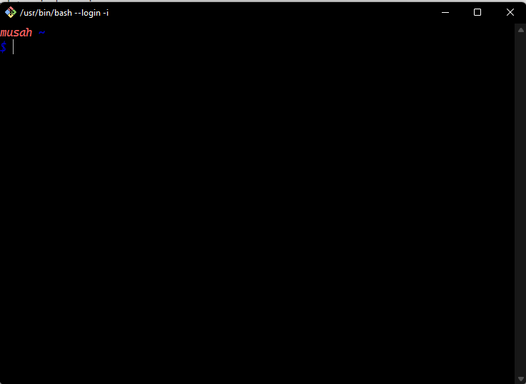

# mia-bash-terminal
a nice bash terminal overview

## instructions

- download this repo as zip or clone it using git in the cmd window
- extract it and copy the  `mia-terminal-config` and `bash_profile` to the root users folder (`c:\users\<user-name>`)
- make sure git is installed on your system download it from [git-bash](<https://git-scm.com/downloads/>)
- open a new bash window and execute `cd ~` to make sure you are in the users folder
- execute `mv mia-terminal-config .mia-terminal-config`
- execute `mv bash_profile .bash_profile`
- close the git bash window and re-open it

## optional

- install cascadia-code font, download from [cascadia code](<https://github.com/microsoft/cascadia-code/releases/tag/v2108.26/>)
- set the default font of the git terminal to cascadia code or equivalent
